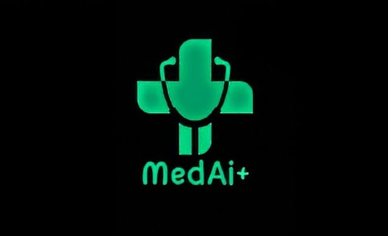

<p align="center">
  
</p>

# AgentCDS 

Agentic Clinical Decision Support using HyDE + Self-RAG + CRAG
with FastMCP 2.0 clinical knowledge integrations.

## Setup

```bash
pip install -e .
cp .env.example .env
```

Choose an LLM backend in `.env`:

```env
# Option 1: local transformers model (default)
LLM_PROVIDER=local
LLM_MODEL=TinyLlama/TinyLlama-1.1B-Chat-v1.0

# Option 2: OpenAI API
LLM_PROVIDER=openai
OPENAI_API_KEY=<your-openai-key>
LLM_MODEL=gpt-4o-mini
# Optional: OPENAI_BASE_URL=https://<your-compatible-endpoint>/v1
```

## Run

```bash
python examples/run_demo.py          # full diagnostic session (DEMO-001 pancytopenia)
python examples/call_mcp_tools.py   # call MCP tools directly
```

## Project Structure

```
agentcds/
├── config.py           # settings from .env
├── schemas.py          # Patient, Hypothesis, DiagnosticResult dataclasses
├── llm.py              # LLM backend wrapper (local transformers or OpenAI)
├── vector_store.py     # ChromaDB (in-memory)
├── rag/
│   ├── hyde.py         # Hypothetical Document Embeddings retrieval
│   ├── self_rag.py     # evidence grading (relevance, support, utility)
│   ├── crag.py         # Corrective RAG on contradictions
│   └── pipeline.py     # main iterative loop
├── mcp/
│   ├── pubmed.py       # FastMCP 2.0 server — NCBI PubMed
│   ├── rxnorm.py       # FastMCP 2.0 server — NLM RxNorm drug interactions
│   └── fhir.py         # FastMCP 2.0 server — patient data (mock + live)
└── agents/
    └── orchestrator.py # top-level: ties everything together
```

## Demo Patients

| ID | Case |
|----|------|
| `DEMO-001` | 54yo M — pancytopenia (MDS vs aplastic anemia vs AML) |
| `DEMO-002` | 32yo F — post-partum DVT/PE |

## MCP Servers (optional standalone mode)

Each server can also be run over HTTP independently:
```bash
python -m agentcds.mcp.pubmed    # port 8001
python -m agentcds.mcp.rxnorm    # port 8002
python -m agentcds.mcp.fhir      # port 8003
```

## Key Config (`.env`)

| Variable | Default | Description |
|----------|---------|-------------|
| `LLM_PROVIDER` | `local` | LLM backend (`local` or `openai`) |
| `HF_TOKEN` | required | HuggingFace API token |
| `LLM_MODEL` | `BioMistral/BioMistral-7B` | Medical LLM |
| `OPENAI_API_KEY` | empty | OpenAI API key |
| `OPENAI_BASE_URL` | empty | Optional OpenAI-compatible API base URL |
| `PUBMED_KEY` | optional | NCBI key (raises rate limit) |

<p align="center">
  
</p>
